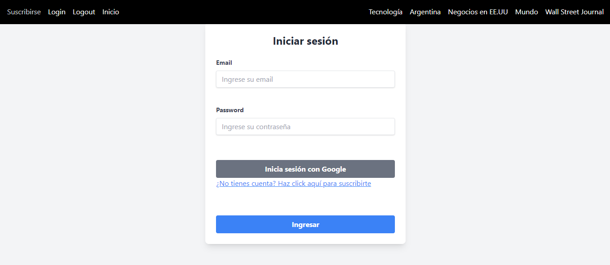

# Portal de Noticias Full Stack stack PERN

Este proyecto es un portal de noticias desarrollado utilizando el stack PERN (PostgreSQL, Express.js, React.js, Node.js). La aplicación permite a los usuarios leer y publicar noticias, así como autenticarse mediante Google Auth. La gestión de sesiones se realiza mediante JSON Web Tokens (JWT) para asegurar una experiencia de usuario segura y eficiente.

## Características Principales

- **Autenticación de Usuarios:**
  - Integración con Google Auth para el inicio de sesión rápido y seguro.
  - Gestión de sesiones mediante JWT, asegurando que solo los usuarios autenticados puedan acceder a ciertas funciones.
  
- **Base de Datos:**
  - Utilización de PostgreSQL para el almacenamiento robusto y eficiente de datos.
  
- **Backend:**
  - Construido con Node.js y Express.js para manejar las solicitudes HTTP y las interacciones con la base de datos.
  
- **Frontend:**
  - Desarrollado con React.js para crear una interfaz de usuario interactiva y dinámica.

## Flujo de Trabajo

1. **Registro e Inicio de Sesión:**
   - Los usuarios pueden registrarse o iniciar sesión utilizando su cuenta de Google.
   - Al iniciar sesión, se genera un JWT que se envía al cliente para mantener la sesión activa.

2. **Publicación y Lectura de Noticias:**
   - Los usuarios autenticados pueden publicar nuevas noticias.
   - Todos los usuarios pueden leer las noticias publicadas en el portal.

3. **Gestión de Sesiones:**
   - El JWT se almacena en el almacenamiento local del navegador y se envía con cada solicitud para verificar la identidad del usuario.
   - Los tokens tienen un tiempo de expiración para aumentar la seguridad.

## Tecnologías Utilizadas

- **Frontend:**
  - React.js
  - React Router (para la navegación)
  - Axios (para las solicitudes HTTP)

- **Backend:**
  - Node.js
  - Express.js
  - JSON Web Token (JWT) (para la autenticación y gestión de sesiones)

- **Base de Datos:**
  - PostgreSQL

- **Autenticación:**
  - Google OAuth 2.0

## Contribución

El proyecto está abierto a contribuciones. Los interesados pueden clonar el repositorio y enviar pull requests para añadir nuevas funcionalidades o mejorar las existentes.

